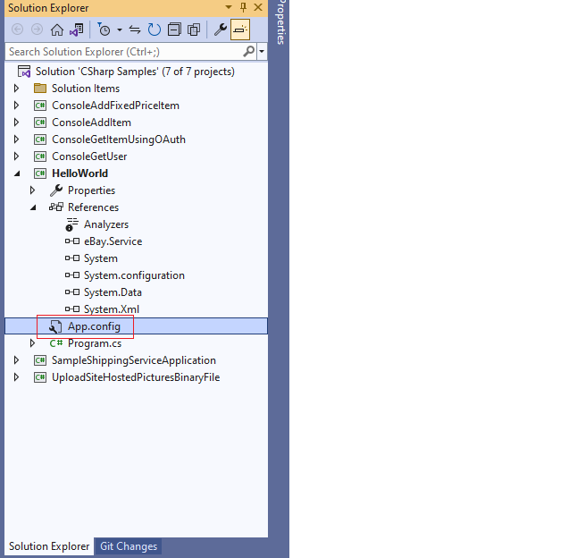
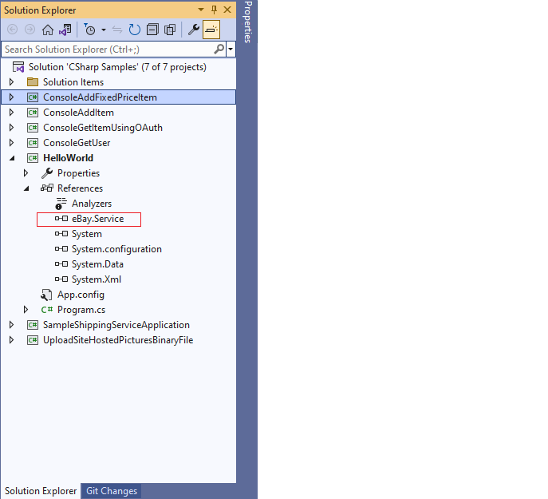
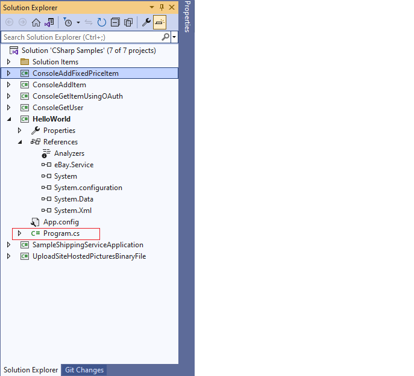
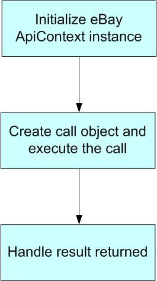

# Hello World -- eBay API/SDK Tutorial

This tutorial shows the bare minimum to get started with eBay API and
SDK.

You can find the code used in this tutorial in Samples/C#/HelloWorld
folder of the .NET SDK package.

## Prerequisites:

1. eBay Trading SDK for .NET Framework 4.8

2. An eBay User Token

3. Visual Studio 2022


## Steps to Create the Hello World Sample:

1. Create a new console application called HelloWorld in Visual Studio
(see Fig 1).


Fig. 1. HelloWorld Project

2. Add a new application configuration file (App.config, see Fig. 2) to
this project. This file will contain configuration information, such as
your eBay user token and the API Server URL, needed for calling the eBay
API (see Listing 1). Please update the token value with your own token
before you run this sample.



Fig. 2. App.config file

```XML
<?xml version="1.0" encoding="utf-8"?>
<configuration>
    <appSettings>
        <!-- API Server URL, required -->
        <!-- For production site use: https://api.ebay.com/wsapi -->
        <!-- For Sandbox site use: https://api.sandbox.ebay.com/wsapi -->
        <add key="Environment.ApiServerUrl" value="https://api.sandbox.ebay.com/wsapi"/>

        <!-- User token for API server access, required -->
        <add key="UserAccount.ApiToken" value="you ebay user token"/>
    </appSettings>
</configuration>
```

Listing 1. Content of App.config

3. Add references to the eBay.Service assembly and the
System.configuration .Net assembly (see Fig. 3). Find the assembly in
the root folder of your eBay SDK for .Net installation. eBay.Service
assembly is the main component of the SDK. It encapsulates eBay API
calls and hides the low-level communication details from you.



Fig 3. eBay.Service assembly

4. Add the following source code (see Listing 2) in the main Program
class (see Fig. 4)



Fig 4. Main Program
``` C#
using System;
using System.Configuration;
using eBay.Service.Call;
using eBay.Service.Core.Sdk;
using eBay.Service.Core.Soap;
namespace HelloWorld
    {
    /// <summary>
    /// A hello world type of sample,
    /// showing how to call eBay API using eBay SDK
    /// </summary>
    class Program
    {
        private static ApiContext apiContext = null;
        static void Main(string[] args)
        {
            Console.WriteLine("+++++++++++++++++++++++++++++++++++++++");
            Console.WriteLine("+ Welcome to eBay SDK for .Net Sample +");
            Console.WriteLine("+ - HelloWorld +");
            Console.WriteLine("+++++++++++++++++++++++++++++++++++++++");
            //[Step 1] Initialize eBay ApiContext object

            ApiContext apiContext = GetApiContext();

            //[Step 2] Create Call object and execute the Call
            GeteBayOfficialTimeCall apiCall = new
            GeteBayOfficialTimeCall(apiContext);

            Console.WriteLine("Begin to call eBay API, please wait ...");
            DateTime officialTime = apiCall.GeteBayOfficialTime();
            Console.WriteLine("End to call eBay API, show call result:");

            //[Step 3] Handle the result returned
            Console.WriteLine("eBay official Time: " + officialTime);
            Console.WriteLine();
            Console.WriteLine("Press any key to close the program.");
            Console.ReadKey();
        }

        /// <summary>
        /// Populate eBay SDK ApiContext object with data from application configuration file

        /// </summary>
        /// <returns>ApiContext</returns>
        static ApiContext GetApiContext()
        {
        //apiContext is a singleton,
        //to avoid duplicate config file reading
        if (apiContext != null)
        {
            return apiContext;
        }
        else
        {
        apiContext = new ApiContext();
        //set Api Server Url
        apiContext.SoapApiServerUrl =ConfigurationManager.AppSettings["Environment.ApiServerUrl"];

        //set Api Token to access eBay Api Server
        ApiCredential apiCredential = new ApiCredential();
        apiCredential.eBayToken =ConfigurationManager.AppSettings["UserAccount.ApiToken"];
        apiContext.ApiCredential = apiCredential;

        //set eBay Site target to US
        apiContext.Site = SiteCodeType.US;
        return apiContext;
        }
        }
    }
}
```
Listing 2. Source Code of the Program

5. Debug the HelloWorld project in Visual Studio. You will see
following output in the Console window (see Fig. 5):


Fig 5. Console Output

This sample calls the GeteBayOfficialTime API to get eBay official time.
If everything works correctly, you will see eBay official time returned
in the output window.

You now have a working sample that can call eBay API using the eBay SDK.
Congratulations!

## Call Flow Analysis

A typical eBay API/SDK call paradigm (see Fig 6) involves three steps.
Below is an analysis of each step. Please use source code listed above
(Listing 2) as a reference.



Fig 6. Typical eBay API/SDK Call Paradigm

**[Step 1] Initialize eBay ApiContext object**

In order to call the eBay API, you need to initialize an ApiContext
object first. The ApiContext object contains all the configurations and
settings that are necessary to call the eBay API.

In the sample, we populate the ApiContext object with a user token and
server URL found in the App.config file. We also set Site in the
ApiContext object to target the eBay US site.

There are other configurations and settings in the ApiContext object.
This sample only shows an introductory minimum. Please refer to the SDK
docs and source code for more details.

**[Step 2] Create call object and execute the call**

For each eBay API call, there is a corresponding wrapper class in the
SDK. For example, GeteBayOfficialTimeCall is a wrapper class for the
GeteBayOfficialTime API call.

In the sample, we created a new instance of the GeteBayOfficialTimeCall
wrapper class, and then we called its GeteBayOfficialTime() method. If
the call is successful, a DateTime class instance containing eBay
official time will be returned.

Because of the wrapper class, you only need to write a few lines of code
to talk to the eBay server. Behind the scenes, the eBay SDK handles the
low-level communication with the eBay server for you.

**[Step 3] Handle the result returned**

After you get the response, you can handle the response according to
your own requirements. In the sample, we just output the returned eBay
official time in the console.
