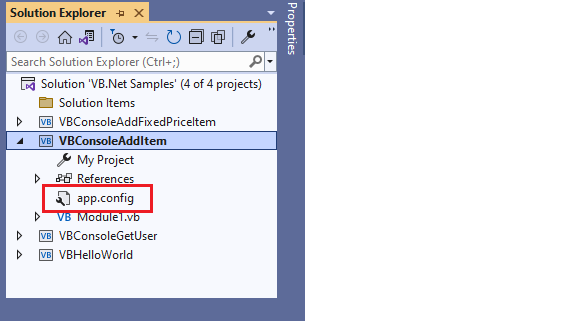
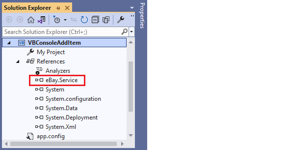
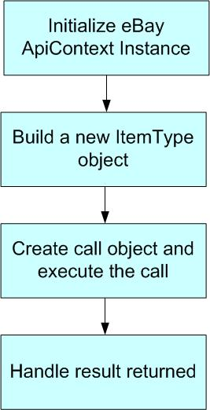

# Console Add Item -- eBay API/SDK Tutorial for VB.Net

This tutorial shows the bare minimum to create a new listing on eBay site using eBay SDK/API. You can find the code used in this tutorial in the Samples/VB.NET/ConsoleAddItem folder of the .NET SDK package.

**Prerequisites** :

1. eBay Trading SDK for .NET Framework 4.8

2. An eBay user token

3. Visual Studio 2022


## Steps to Create the Console Add Item Sample:

**1.** Create a new Visual Basic Console Application called
ConsoleAddItem in Visual Studio (see Fig 1).


Fig 1. ConsoleAddItem Project

**2.** Add a new application configuration file (App.config, see Fig. 2)
to this project. This file will contain some configuration information
such as your eBay user token and the API Server Url, that are necessary
for calling the eBay API (see Listing 1). Please update the token value
with your own token before you run this sample.



Fig 2. Application configuration file

<?xml version="1.0" encoding="utf-8" ?>

<configuration>

<appSettings>

<!-- API Server URL, required -->

<!-- For production site use: https://api.ebay.com/wsapi -->

<!-- For Sandbox site use: https://api.sandbox.ebay.com/wsapi -->

<add key="Environment.ApiServerUrl"
value="https://api.sandbox.ebay.com/wsapi"/>

<!-- User token for API server access (required) -->

<add key="UserAccount.ApiToken" value="your ebay user token"/>

</appSettings>

</configuration>

Listing 1. Content of App.config

**3.** Add a reference to the eBay.Service assembly (see Fig 3). You
will find the assembly in the root folder of your eBay SDK for .Net
installation. eBay.Service assembly is the main component of the SDK,
and it encapsulates eBay API calls and hides the low-level communication
details from you. Make sure you also add a reference to the
System.configuration .Net assembly.



Fig 3. eBay.Service assembly

**4.** In the main Module file (see Fig 4), import the following .Net
namespaces and SDK namespaces so you can have reference to calls and
classes in the SDK (see Listing 2). Provide the module name and the
variable definition at the same time.


Fig 4. The Main Module File

```VB

Imports System.Configuration
Imports eBay.Service.Call
Imports eBay.Service.Core.Sdk
Imports eBay.Service.Core.Soap
Imports eBay.Service.Util

Module Module1
    Private apiContext As ApiContext = Nothing
```

Listing 2. Import Namespace

**5.** In order to call the eBay API, first you need to initialize an
ApiContext object. ApiContext object contains all the configurations and
settings that are necessary for calling the eBay API.

In the main Module file, create a function called GetApiContext (see
Listing 3). In this function, we populate the ApiContext object with
your user token and the API server Url found in the App.config file. We
also set Site on the ApiContext object to target the eBay U.S. site.

You can configure the ApiContext object to log all of the communication
to a logger (for example, a text file). Here, we're going to log all the
SOAP messages to a text file. If anything goes wrong, logging is
extremely helpful for troubleshooting.

```VB
''' <summary>
''' Populate eBay SDK ApiContext instance with data from application configuration file
''' </summary>
''' <returns>ApiContext instance</returns>
''' <remarks></remarks>
Private Function GetApiContext() As ApiContext
    'apiContext is a singleton
    'to avoid duplicate configuration reading

    If (apiContext IsNot Nothing) Then
        Return apiContext
    Else
        apiContext = New ApiContext

        'set Api Server Url
        apiContext.SoapApiServerUrl = _

        ConfigurationManager.AppSettings.Get("Environment.ApiServerUrl")

        'set Api Token to access eBay Api Server
        Dim apiCredential As ApiCredential = New ApiCredential

        apiCredential.eBayToken = _ConfigurationManager.AppSettings.Get("UserAccount.ApiToken")
        apiContext.ApiCredential = apiCredential

        'set eBay Site target to US
        apiContext.Site = SiteCodeType.US

        'set Api logging
        apiContext.ApiLogManager = New ApiLogManager

        Dim fileLogger As FileLogger = New FileLogger("listing_log.txt", True,
        True, True)
        apiContext.ApiLogManager.ApiLoggerList.Add(fileLogger)
        Return apiContext
    End If

End Function
```
Listing 3. GetApiContext function

**6.** In order to list an item on eBay, first you need to create a new
instance of the ItemType class.

In the main Module file, create a function called BuildItem (see Listing
4). In this function, we populate the item with information such as item
title and description, listing category, payment methods and shipping
details, etc. For a detailed discussion about what information you
should provide to list an item, please refer to the eBay Trading API
[documentation](http://developer.ebay.com/DevZone/XML/docs/WebHelp/ListingItems-Listing_an_Item.html).

```VB
''' <summary>
''' Build a sample item
''' </summary>
''' <returns>ItemType instance</returns>
Private Function BuildItem() As ItemType
    Dim item As ItemType = New ItemType()

    ' item title
    item.Title = "Test Item"
    ' item description

    item.Description = "eBay SDK sample test item"

    ' listing type
    item.ListingType = ListingTypeCodeType.Chinese

    ' listing price
    item.Currency = CurrencyCodeType.USD
    item.StartPrice = New AmountType()
    item.StartPrice.Value = 20
    item.StartPrice.currencyID = CurrencyCodeType.USD

    ' listing duration
    item.ListingDuration = "Days_3"

    ' item location and country
    item.Location = "San Jose"
    item.Country = CountryCodeType.US

    ' listing category , Photography Software
    Dim category As CategoryType = New CategoryType()
    category.CategoryID = "30022"
    item.PrimaryCategory = category

    ' item quality
    item.Quantity = 1

    ' payment methods
    item.PaymentMethods = New BuyerPaymentMethodCodeTypeCollection()
    item.PaymentMethods.Add(BuyerPaymentMethodCodeType.PayPal)

    ' email is required if paypal is used as payment method
    item.PayPalEmailAddress = <me@ebay.com>

    ' item condition, New
    item.ConditionID = 1000

    ' handling time is required
    item.DispatchTimeMax = 1

    ' shipping details
    item.ShippingDetails = BuildShippingDetails()

    ' return policy
    item.ReturnPolicy = New ReturnPolicyType()
    item.ReturnPolicy.ReturnsAcceptedOption = "ReturnsAccepted"
    Return item

End Function
```
Listing 4. BuildItem function

**7.** In the main Module file, create a helper function called
BuildShippingDetails (see Listing 5). This function is used by the
BuildItem function to build sample shipping details.
``` VB
''' <summary>
''' Build sample shipping details
''' </summary>
''' <returns>ShippingDetailsType instance</returns>
Private Function BuildShippingDetails() As ShippingDetailsType
    ' Shipping details
    Dim sd As ShippingDetailsType = New ShippingDetailsType()
    sd.ApplyShippingDiscount = True
    Dim amount As AmountType = New AmountType()
    amount.Value = 2.8
    amount.currencyID = CurrencyCodeType.USD
    sd.PaymentInstructions = "eBay .Net SDK test instruction."
    ' Shipping type and shipping service options
    sd.ShippingType = ShippingTypeCodeType.Flat
    Dim shippingOptions As ShippingServiceOptionsType = New
    ShippingServiceOptionsType()
    shippingOptions.ShippingService = _ShippingServiceCodeType.ShippingMethodStandard.ToString()
    amount = New AmountType()
    amount.Value = 2.0
    amount.currencyID = CurrencyCodeType.USD
    shippingOptions.ShippingServiceAdditionalCost = amount
    amount = New AmountType()
    amount.Value = 10
    amount.currencyID = CurrencyCodeType.USD
    shippingOptions.ShippingServiceCost = amount

    shippingOptions.ShippingServicePriority = 1
    amount = New AmountType()
    amount.Value = 1.0
    amount.currencyID = CurrencyCodeType.USD
    shippingOptions.ShippingInsuranceCost = amount
    sd.ShippingServiceOptions = New ShippingServiceOptionsTypeCollection()
    sd.ShippingServiceOptions.Add(shippingOptions)

    Return sd

End Function
```
Listing 5. BuildShippingDetails function

**8.** Now that all building blocks are ready, let's wire them together
in the Main function (see Listing 6). The overall call flow is shown in
Fig 5:

```VB
Sub Main()
Try
    Console.WriteLine("+++++++++++++++++++++++++++++++++++++++")
    Console.WriteLine("+ Welcome to eBay SDK for .Net Sample +")
    Console.WriteLine("+ - ConsoleAddItem +")
    Console.WriteLine("+++++++++++++++++++++++++++++++++++++++")
    '[Step 1] Initialize eBay ApiContext object
    Dim apiContext As ApiContext = GetApiContext()

    '[Step 2] Create a new ItemType object
    Dim item As ItemType = BuildItem()

    '[Step 3] Create Call object and execute the Call
    Dim apiCall As AddItemCall = New AddItemCall(apiContext)
    Console.WriteLine("Begin to call eBay API, please wait ...")
    Dim fees As FeeTypeCollection = apiCall.AddItem(item)
    Console.WriteLine("End to call eBay API, show call result ...")
    Console.WriteLine()

    '[Step 4] Handle the result returned
    Console.WriteLine("The item was listed successfully!")
    Dim listingFee As Double = 0.0
    Dim fee As FeeType
    For Each fee In fees
    If (fee.Name = "ListingFee") Then
     listingFee = fee.Fee.Value
    End If

    Next
    Console.WriteLine(String.Format("Listing fee is: {0}", listingFee))
    Console.WriteLine(String.Format("Listed Item ID: {0}", item.ItemID))

    Catch ex As Exception
    Console.WriteLine("Fail to list the item : " + ex.Message)

End Try

Console.WriteLine()
Console.WriteLine("Press any key to close the program.")
Console.ReadKey()

End Sub
```
Listing 6. the Main function



Fig 5. The Call Flow

After the ItemType instance is created, we call the AddItem API and pass
in the newly created ItemType instance as a parameter. If the call is
successful, a FeeTypeCollection class instance will be returned. This
collection instance contains all of the individual fees resulting from
the item listing. Lastly, we output the Listing fee and Listed Item ID
in the console (for your application you can handle the response
according to your own requirements). The main function also shows the
basic exception handling. If anything goes wrong, you are responsible
for catching and handling exceptions accordingly.

**9.** Debug the ConsoleAddItem project in Visual Studio. You will see
the following output in the console window (see Fig 6.). If anything
goes wrong, you can check the log file in the binDebug folder for
troubleshooting:


Fig 6. Console Output

**10.** If the listing is successful, you can verify the item by
searching the item ID in the eBay sandbox (or production if you
configured production API server Url in the application configuration
file) 
 


